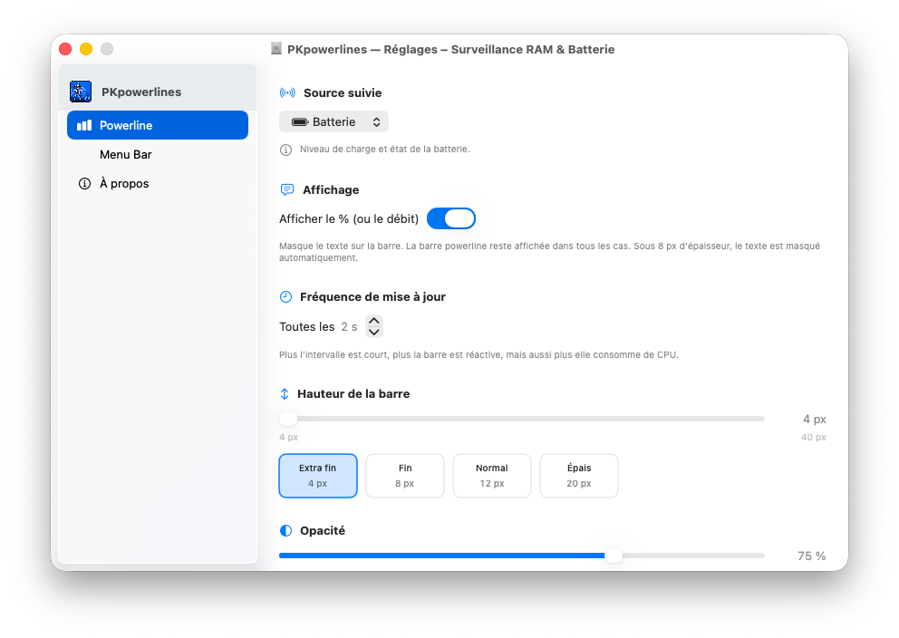

# PKpowerlines


[🇫🇷 FR](README.md) · [🇬🇧 EN](README_en.md)

✨ Application macOS native (menu-bar) qui affiche une barre en temps réel en haut de chaque écran : RAM ou batterie. Binaire universel Intel + Apple Silicon.

Version **2026.09.05**



## ✅ Fonctionnalités

- 📊 **Quatre sources** — RAM (active + wired), **CPU** (charge globale), **Réseau** (débit ↓/↑), Batterie (pourcentage, état de charge, couleur dynamique)
- 🖥️ **Multi-écrans** — une barre par écran
- 🧭 **4 bords** — haut, bas, **gauche**, **droite** (barre verticale sur les côtés)
- 👁️ **Toggle %** — afficher ou masquer le texte (barre powerline toujours présente)
- 🌌 **Toujours visible** — tous les Spaces, niveau barre système, click-through
- 🎨 **Couleurs custom** — RAM, CPU, Réseau, Batterie, Batterie faible, couleur de charge, toutes modifiables via ColorPicker
- 🔤 **Police custom** — 7 polices au choix, taille auto-adaptative, % centré verticalement
- 🎚️ **Hauteur custom** — slider 4–40px + 4 presets (⌘4/⌘1/⌘2/⌘3)
- 💧 **Opacité** — de 20% à 100%
- 🌊 **Flux animé** — reflet fluide permanent ; pulsation renforcée en charge
- ↕️ **Offset** — pixel par pixel (peut chevaucher la menu bar, ou décaler sur les côtés)
- ⏱️ **Fréquence** — mise à jour toutes les 1–10s
- 🧩 **Binaire universel** — `arm64` + `x86_64`
- 🪟 **Réglages SwiftUI** — sidebar avec recherche (groupes POWERLINE / PK PROJECTS), pages **Bibliothèque** (projets PK en cartes) et **Aide & don** (Ko-fi)

## 🎨 États de la batterie


- **Normale** — la barre se remplit proportionnellement au pourcentage, avec la couleur Batterie (vert par défaut)
- **Faible** — sous le seuil (25 % par défaut, réglable) : couleur Batterie faible (rouge) et % forcé à l'affichage, même sous 8 px
- **En charge** — couleur de charge (bleu), préfixe ⚡ et pulsation animée de la barre
- Sous 8 px de hauteur, le % est masqué automatiquement (sauf batterie faible)

## 🧠 Utilisation

 1. Lance l'app → la barre apparaît en haut.
 2. Clique sur l'**icône PKpowerlines** dans la barre des menus :
    - **Réglages…** (⌘,) — change le mode, la couleur, la position, la police
    - **Repositionner** (⌘R) — force le repositionnement de la powerline (utile après changement de résolution)
    - Presets hauteur (⌘4 / ⌘1 / ⌘2 / ⌘3)
    - **Quitter** (⌘Q)

## ⚙️ Réglages

| Réglage | Valeurs | Accès |
|---|---|---|
| Source | RAM / Batterie / CPU / Réseau | Réglages → Powerline |
| Afficher le % | On / Off | Réglages → Powerline |
| Forcer le % en batterie faible | On / Off (défaut : On) | Réglages → Powerline |
| Fréquence | 1–10s | Réglages → Powerline |
| Hauteur | 4–40px | Réglages → Powerline (slider) |
| Presets hauteur | 4 / 8 / 12 / 20px | Réglages → Powerline ou ⌘4/⌘1/⌘2/⌘3 |
| Opacité | 20–100% | Réglages → Powerline |
| Police | 7 polices | Réglages → Powerline |
| Couleur RAM | ColorPicker | Réglages → Powerline |
| Couleur CPU | ColorPicker | Réglages → Powerline |
| Couleur Réseau | ColorPicker | Réglages → Powerline |
| Plafond réseau | 1–1000 MB/s | Réglages → Powerline |
| Couleur Batterie | ColorPicker | Réglages → Powerline |
| Couleur Batterie faible | ColorPicker + seuil | Réglages → Powerline |
| Position | Haut / Bas / Gauche / Droite | Réglages → Powerline |
| Offset | -40 à +400px (1px par 1px) | Réglages → Powerline |
| Quitter | — | ⌘Q |

## 📦 Build & Package

**Build debug :**
```bash
swift run
```

**Build release universel + bundle `.app` :**
```bash
./build_app.sh
open release/macos/PKpowerlines.app
```

`build_app.sh` compile en universal binary (`--arch arm64 --arch x86_64`) et génère `release/macos/PKpowerlines.app`.

**Vérifier l'architecture :**
```bash
file release/macos/PKpowerlines.app/Contents/MacOS/PKpowerlines
# → Mach-O universal binary with 2 architectures: [x86_64] [arm64]
```

## 🧪 Arrêt

```bash
killall PKpowerlines
```

## 🛠️ Développement

```
PKpowerlines/
├── src/
│   └── macos/
│       ├── App/
│       │   ├── main.swift              # Point d'entrée NSApplication
│       │   └── AppDelegate.swift       # Status bar, fenêtres barre, monitoring
│       ├── Models/
│       │   ├── AppSettings.swift       # ObservableObject (UserDefaults)
│       │   ├── MonitorType.swift       # {.ram, .battery}
│       │   ├── BarPosition.swift       # {.top, .bottom}
│       │   ├── BarFont.swift           # 7 polices au choix
│       │   └── MenuBarSpacing.swift    # Espacement barre / menu
│       ├── Monitors/
│       │   ├── RAMMonitor.swift        # sysctl/host_statistics64
│       │   ├── CPUMonitor.swift        # host_statistics64 / HOST_CPU_LOAD_INFO
│       │   ├── NetworkMonitor.swift    # getifaddrs delta (↓/↑ KB/s)
│       │   └── BatteryMonitor.swift    # IOKit (IOPMPowerSource)
│       ├── Views/
│       │   ├── PowerBarView.swift             # Vue AppKit de la barre
│       │   └── Settings/
│       │       ├── SettingsView.swift         # NavigationSplitView racine
│       │       ├── MenuBarSettingsView.swift  # Barre menu (hauteur, opacité…)
│       │       ├── PowerlineSettingsView.swift# Couleurs, police, position
│       │       └── AboutSettingsView.swift    # À propos
│       └── Utils/
│           └── ColorHex.swift          # Color <-> hex
├── store/                                      # Laius store + captures d'écran
├── ProjectIcons/                               # Icônes des projets PK (page Bibliothèque)
├── ProjectScreenshots/                         # Captures des projets PK (page Bibliothèque)
├── release/macos/                            # Sortie build (gitignoré)
├── benchmark/                                # Références, captures
├── secrets/                                  # Credentials (gitignoré)
├── Package.swift                             # SwiftPM (macOS 13+, IOKit linké)
├── build_app.sh                              # Build universel + bundle
├── AGENTS.md                                 # Instructions agent
├── LICENSE                                   # MIT
├── README.md / README_en.md
├── VERSION / CHANGELOG.md
└── icon.png
```

- **Plateforme** : macOS 13.0+
- **Dépendances** : aucune (AppKit + SwiftUI + IOKit natifs)
- **Architectures** : arm64 + x86_64 (universal)
- **Activation** : `LSUIElement` (menu-bar pure, pas d'icône Dock)

## 🧾 Changelog

Voir [CHANGELOG.md](CHANGELOG.md).

## 🔗 Liens

- README anglais : [README_en.md](README_en.md)
