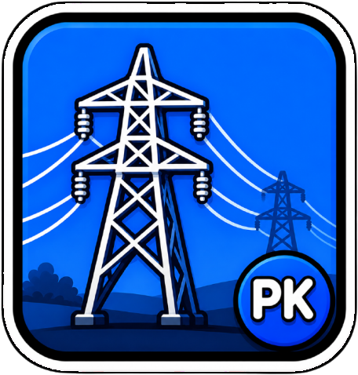

# PKpowerlines



[🇬🇧 EN](README_en.md) · [🇫🇷 FR](README.md)

✨ Native macOS menu-bar app that displays a real-time bar at the top of every screen: RAM or battery. Universal Intel + Apple Silicon binary.

## ✅ Features

- 📊 **Two modes** — RAM (active + wired) or Battery (percentage, charging state, dynamic color)
- 🖥️ **Multi-screen** — one bar per screen
- 🌌 **Always visible** — every Space, status bar level, click-through
- 🎨 **Custom colors** — RAM, Battery, Low-battery, Charging colors via ColorPicker
- 🔤 **Custom font** — 7 fonts, auto-adaptive size, vertically centered percentage
- 🎚️ **Custom height** — slider 4–40px + 3 presets (⌘1/⌘2/⌘3)
- 💧 **Opacity** — 20% to 100%
- ↕️ **Position** — top or bottom + pixel-by-pixel offset (can overlap the menu bar)
- ⏱️ **Frequency** — refresh every 1–10s
- 🧩 **Universal binary** — `arm64` + `x86_64`
- 🪟 **SwiftUI settings window** — 3-tab sidebar, native macOS style

## 🧠 Usage

1. Launch the app → the bar appears at the top.
2. Click the **PKpowerlines icon** in the menu bar:
   - **Settings…** (⌘,) — change mode, color, position, font
   - Height presets (⌘1 / ⌘2 / ⌘3)
   - **Quit** (⌘Q)

## ⚙️ Settings

| Setting | Values | Access |
|---|---|---|
| Source | RAM / Battery | Settings → General |
| Frequency | 1–10s | Settings → General |
| Height | 4–40px | Settings → Appearance (slider) |
| Height presets | 8 / 12 / 20px | Settings → Appearance or ⌘1/⌘2/⌘3 |
| Opacity | 20–100% | Settings → Appearance |
| Font | 7 fonts | Settings → Appearance |
| RAM color | ColorPicker | Settings → Appearance |
| Battery color | ColorPicker | Settings → Appearance |
| Low-battery color | ColorPicker + threshold | Settings → Appearance |
| Position | Top / Bottom | Settings → Position |
| Vertical offset | -40 to +400px (1px steps) | Settings → Position |
| Quit | — | ⌘Q |

## 📦 Build & Package

**Debug build:**
```bash
swift run
```

**Universal release build + `.app` bundle:**
```bash
./build_app.sh
open release/macos/PKpowerlines.app
```

`build_app.sh` compiles as a universal binary (`--arch arm64 --arch x86_64`) and produces `release/macos/PKpowerlines.app`.

**Verify architecture:**
```bash
file release/macos/PKpowerlines.app/Contents/MacOS/PKpowerlines
# → Mach-O universal binary with 2 architectures: [x86_64] [arm64]
```

## 🧪 Stop

```bash
killall PKpowerlines
```

## 🛠️ Development

```
PKpowerlines/
├── src/
│   └── macos/
│       ├── App/
│       │   ├── main.swift              # NSApplication entry point
│       │   └── AppDelegate.swift       # Status bar, bar windows, monitoring
│       ├── Models/
│       │   ├── AppSettings.swift       # ObservableObject (UserDefaults)
│       │   ├── MonitorType.swift       # {.ram, .battery}
│       │   ├── BarPosition.swift       # {.top, .bottom}
│       │   ├── BarFont.swift           # 7 selectable fonts
│       │   └── MenuBarSpacing.swift    # Bar / menu spacing
│       ├── Monitors/
│       │   ├── RAMMonitor.swift        # sysctl/host_statistics64
│       │   └── BatteryMonitor.swift    # IOKit (IOPMPowerSource)
│       ├── Views/
│       │   ├── PowerBarView.swift             # AppKit bar view
│       │   └── Settings/
│       │       ├── SettingsView.swift         # Root NavigationSplitView
│       │       ├── MenuBarSettingsView.swift  # Menu bar (height, opacity…)
│       │       ├── PowerlineSettingsView.swift# Colors, font, position
│       │       └── AboutSettingsView.swift    # About
│       └── Utils/
│           └── ColorHex.swift          # Color <-> hex
├── release/macos/                            # Build output (gitignored)
├── benchmark/                                # References, screenshots
├── secrets/                                  # Credentials (gitignored)
├── Package.swift                             # SwiftPM (macOS 13+, links IOKit)
├── build_app.sh                              # Universal build + bundle
├── AGENTS.md                                 # Agent instructions
├── LICENSE                                   # MIT
├── README.md / README_en.md
├── VERSION / CHANGELOG.md
└── icon.png
```

- **Platform**: macOS 13.0+
- **Dependencies**: none (native AppKit + SwiftUI + IOKit)
- **Architectures**: arm64 + x86_64 (universal)
- **Activation**: `LSUIElement` (pure menu-bar, no Dock icon)

## 🧾 Changelog

See [CHANGELOG.md](CHANGELOG.md).

## 🔗 Links

- French README: [README.md](README.md)
