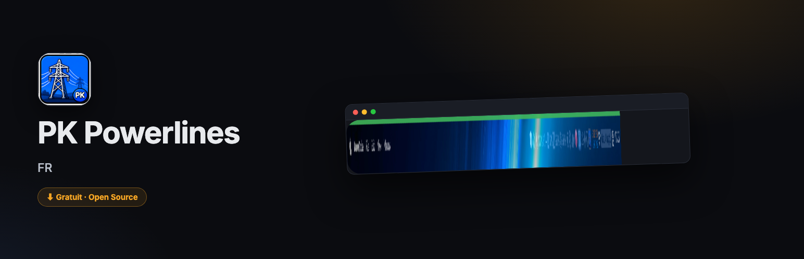
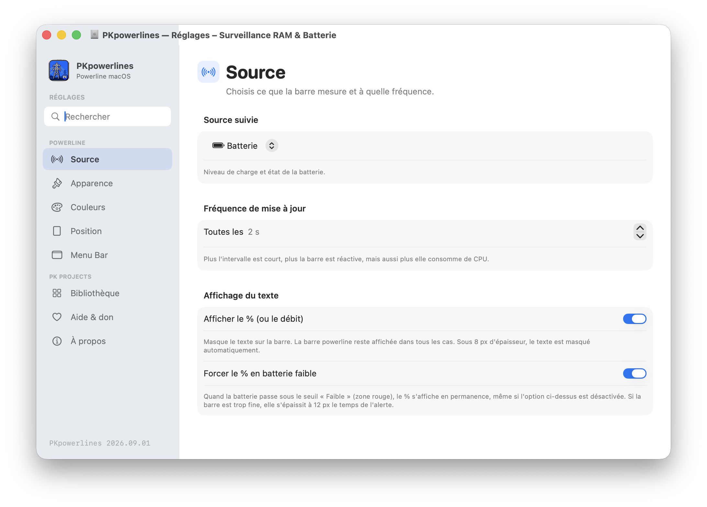
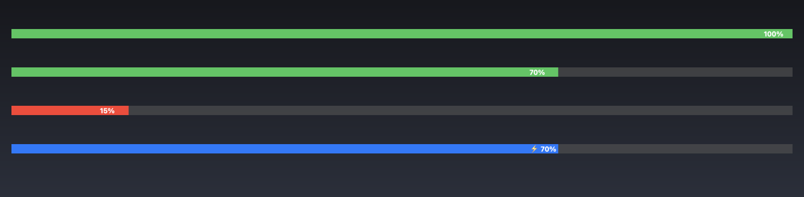

# PKpowerlines



[🇬🇧 EN](README_en.md) · [🇫🇷 FR](README.md)

✨ Native macOS menu-bar app that displays a real-time bar at the top of every screen: RAM or battery. Universal Intel + Apple Silicon binary.

Version **2026.10.4**



## ✅ Features

- 📊 **Four sources** — RAM (active + wired), **CPU** (overall load), **Network** (↓/↑ throughput), Battery (percentage, charging state, dynamic color)
- 🖥️ **Multi-screen** — one bar per screen
- 🧭 **4 edges** — top, bottom, **left**, **right** (vertical bar on the sides)
- 👁️ **% toggle** — show or hide the text (powerline bar always visible)
- 🌌 **Always visible** — every Space, status bar level, click-through
- 🎨 **Custom colors** — RAM, CPU, Network, Battery, Low-battery, Charging colors via ColorPicker
- 🔤 **Custom font** — 7 fonts, auto-adaptive size, vertically centered percentage
- 🎚️ **Custom height** — slider 4–40px + 4 presets (⌘4/⌘1/⌘2/⌘3)
- 💧 **Opacity** — 20% to 100%
- 🌊 **Animated flow** — continuous fluid highlight, with a stronger pulse while charging
- ↕️ **Offset** — pixel by pixel (can overlap the menu bar, or shift on the sides)
- ⏱️ **Frequency** — refresh every 1–10s
- 🧩 **Universal binary** — `arm64` + `x86_64`
- 🪟 **SwiftUI settings** — sidebar with search (POWERLINE / PK PROJECTS groups), **Project Library** (PK projects as cards) and **Help & Donate** (Ko-fi) pages
- 🔄 **Sparkle updates** — About shows the installed version and compares Stable/Dev builds; the sidebar flags available updates and manual checks refresh the feed before invoking Sparkle

## 🎨 Battery states



- **Normal** — the bar fills proportionally to the percentage, using the Battery color (green by default)
- **Low** — below the threshold (25% by default, adjustable): Low-battery color (red) and the percentage is forced on, even under 8 px
- **Charging** — charging color (blue), ⚡ prefix, and an animated bar pulse
- Under 8 px in height, the percentage is hidden automatically (except low battery)

## 🧠 Usage

 1. Launch the app → the bar appears at the top.
 2. Click the **PKpowerlines icon** in the menu bar:
    - **Settings…** (⌘,) — change mode, color, position, font
    - **Reposition** (⌘R) — force powerline repositioning (useful after resolution change)
    - Height presets (⌘4 / ⌘1 / ⌘2 / ⌘3)
    - **Quit** (⌘Q)

## ⚙️ Settings

| Setting | Values | Access |
|---|---|---|
| Source | RAM / Battery / CPU / Network | Settings → Powerline |
| Show % | On / Off | Settings → Powerline |
| Force % on low battery | On / Off (default: On) | Settings → Powerline |
| Frequency | 1–10s | Settings → Powerline |
| Height | 4–40px | Settings → Powerline (slider) |
| Height presets | 4 / 8 / 12 / 20px | Settings → Powerline or ⌘4/⌘1/⌘2/⌘3 |
| Opacity | 20–100% | Settings → Powerline |
| Font | 7 fonts | Settings → Powerline |
| RAM color | ColorPicker | Settings → Powerline |
| CPU color | ColorPicker | Settings → Powerline |
| Network color | ColorPicker | Settings → Powerline |
| Network ceiling | 1–1000 MB/s | Settings → Powerline |
| Battery color | ColorPicker | Settings → Powerline |
| Low-battery color | ColorPicker + threshold | Settings → Powerline |
| Position | Top / Bottom / Left / Right | Settings → Powerline |
| Offset | -40 to +400px (1px steps) | Settings → Powerline |
| Quit | — | ⌘Q |

## 📦 Install

**Direct download** (universal DMG, Intel + Apple Silicon):
```bash
curl -L -o PKpowerlines.dmg https://github.com/mondary/Macos_PKpowerlines/releases/latest/download/PKpowerlines.dmg
```

**Via Homebrew**:
```bash
brew install --cask mondary/tap/pkpowerlines
```

Or from the [Releases](https://github.com/mondary/Macos_PKpowerlines/releases) page — drag the app to Applications.

## 📦 Build & Package

**Debug build:**
```bash
swift run
```

**Universal release build + `.app` bundle:**
```bash
./build_app.sh
open release/macos/PKpowerlines.app
```

`build_app.sh` compiles as a universal binary (`--arch arm64 --arch x86_64`) and produces `release/macos/PKpowerlines.app`.

**Verify architecture:**
```bash
file release/macos/PKpowerlines.app/Contents/MacOS/PKpowerlines
# → Mach-O universal binary with 2 architectures: [x86_64] [arm64]
```

## 🧪 Stop

```bash
killall PKpowerlines
```

## 🛠️ Development

```
PKpowerlines/
├── src/
│   └── macos/
│       ├── App/
│       │   ├── main.swift              # NSApplication entry point
│       │   └── AppDelegate.swift       # Status bar, bar windows, monitoring
│       ├── Models/
│       │   ├── AppSettings.swift       # ObservableObject (UserDefaults)
│       │   ├── MonitorType.swift       # {.ram, .battery}
│       │   ├── BarPosition.swift       # {.top, .bottom}
│       │   ├── BarFont.swift           # 7 selectable fonts
│       │   └── MenuBarSpacing.swift    # Bar / menu spacing
│       ├── Monitors/
│       │   ├── RAMMonitor.swift        # sysctl/host_statistics64
│       │   ├── CPUMonitor.swift        # host_statistics64 / HOST_CPU_LOAD_INFO
│       │   ├── NetworkMonitor.swift    # getifaddrs delta (↓/↑ KB/s)
│       │   └── BatteryMonitor.swift    # IOKit (IOPMPowerSource)
│       ├── Views/
│       │   ├── PowerBarView.swift             # AppKit bar view
│       │   └── Settings/
│       │       ├── SettingsView.swift         # Root NavigationSplitView
│       │       ├── MenuBarSettingsView.swift  # Menu bar (height, opacity…)
│       │       ├── PowerlineSettingsView.swift# Colors, font, position
│       │       └── AboutSettingsView.swift    # About
│       ├── Resources/
│       │   ├── powerline_black.png / powerline_white.png
│       │   ├── ProjectIcons/                 # PK project icons (Library page)
│       │   └── ProjectScreenshots/           # PK project screenshots (Library page)
│       └── Utils/
│           └── ColorHex.swift          # Color <-> hex
├── store/
│   ├── v1/                               # Store copy + screenshots v1
│   ├── v2/                               # Store landing v2
│   └── website/                          # Pixel-art landing (interactive garden)
├── archives/                             # Old working visuals
├── release/macos/                            # Build output (gitignored)
├── secrets/                                  # Credentials (gitignored)
├── Package.swift                             # SwiftPM (macOS 13+, links IOKit)
├── build_app.sh                              # Universal build + bundle
├── AGENTS.md                                 # Agent instructions
├── LICENSE                                   # MIT
├── README.md / README_en.md
├── CHANGELOG.md                              # Version source of truth
└── icon.png
```

- **Platform**: macOS 13.0+
- **Dependencies**: none (native AppKit + SwiftUI + IOKit)
- **Architectures**: arm64 + x86_64 (universal)
- **Activation**: `LSUIElement` (pure menu-bar, no Dock icon)

## 🧾 Changelog

See [CHANGELOG.md](CHANGELOG.md).

## 🔗 Links

- French README: [README.md](README.md)
- Project landing: [store/website/index.html](store/website/index.html)
- ☕ Support development: [Ko-fi](https://ko-fi.com/pouark)
